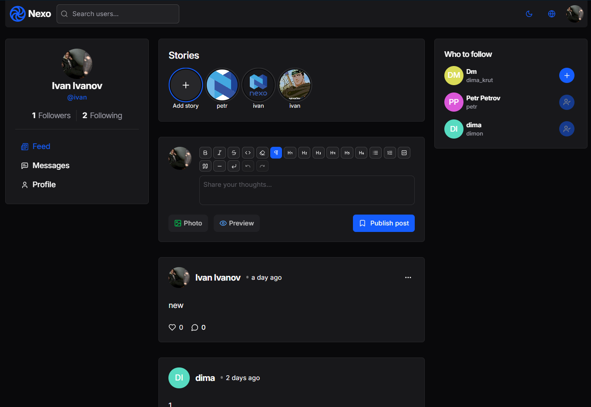
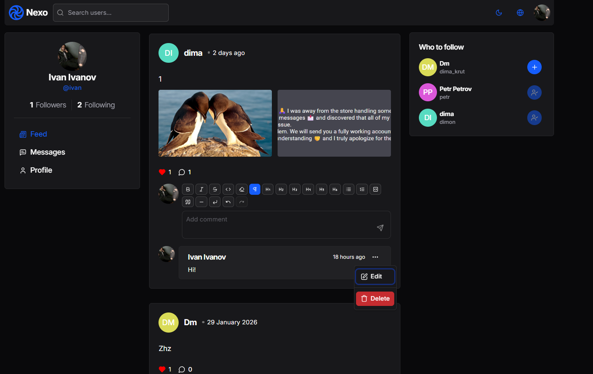
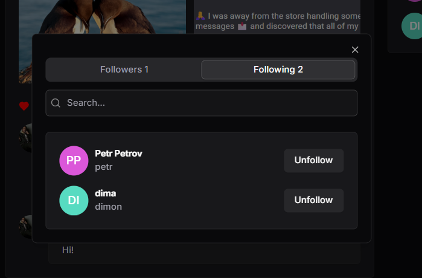
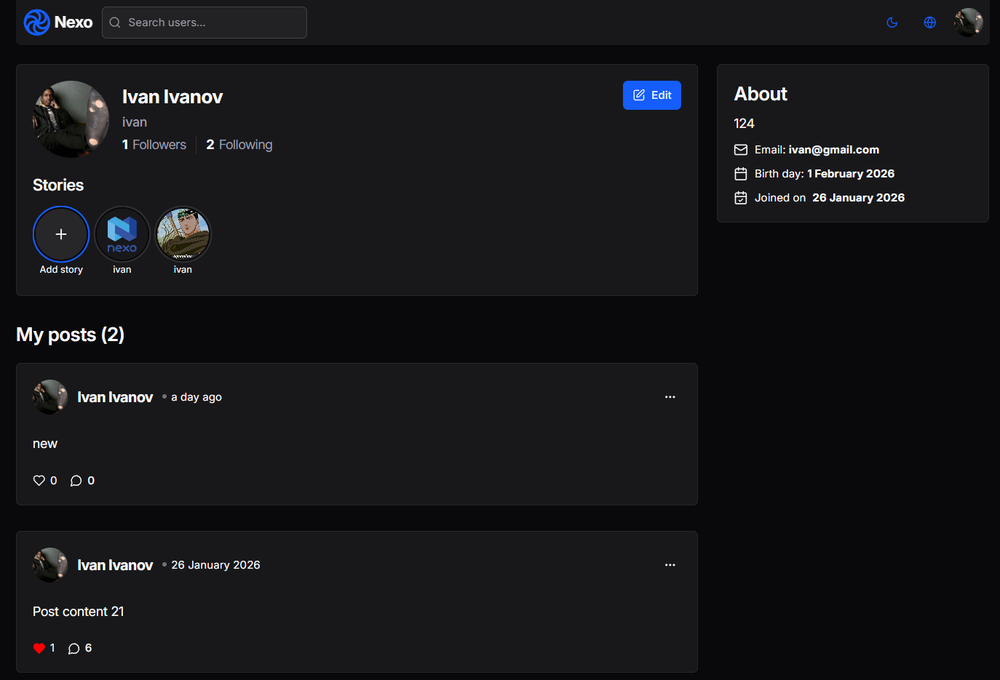
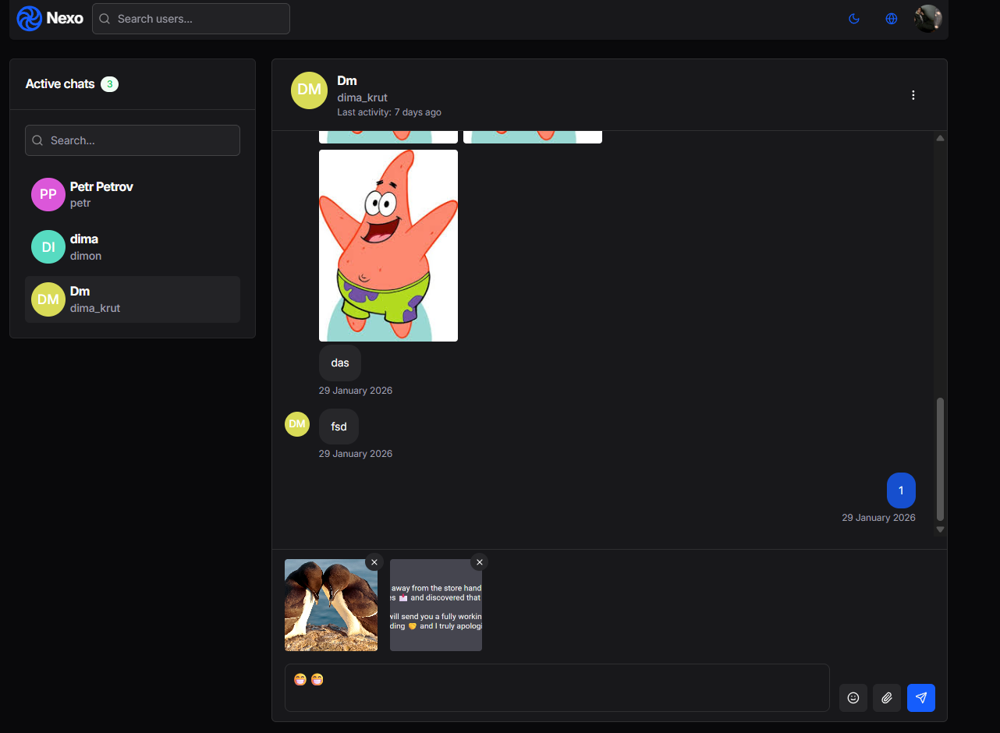
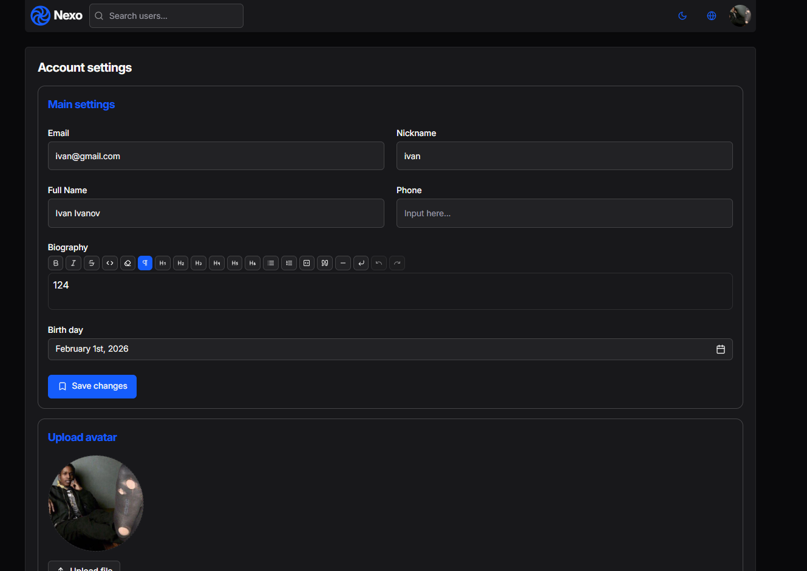

# Nexo Frontend

Frontend for the Nexo social platform (posts, conversations, and connections). Built with React, Vite, and TypeScript and designed to integrate with the Nexo backend through REST (OpenAPI-generated client) and Socket.IO.

## Screenshots

### Feed



### Feed Post



### Subscriptions



### Profile



### Chat



### Settings


### Settings



## Tech Stack

- React 19 + TypeScript
- Vite 6
- Tailwind CSS 4
- React Router
- TanStack Query
- Zustand
- Radix UI
- TipTap editor
- i18next
- Socket.IO client
- Sentry
- Vitest + Testing Library
- ESLint, Prettier, Stylelint, Husky, Commitlint

## Key Capabilities

- Single-page app with client-side routing
- Typed API client generated from Swagger/OpenAPI
- Server state and caching with TanStack Query
- Lightweight client state with Zustand
- Accessible UI primitives via Radix UI
- Utility-first styling with Tailwind CSS, plus `tailwind-merge` and `class-variance-authority`
- Rich text editing with TipTap
- Internationalization with i18next
- Real-time updates through Socket.IO
- Error boundaries and monitoring via `react-error-boundary` and Sentry
- Test coverage with Vitest and Testing Library
- Quality gates through ESLint, Prettier, and Stylelint

## Project Structure

Feature-Sliced style under `src`:

- `app` - app shell, providers, layouts, routing
- `pages` - route-level pages
- `widgets` - large UI blocks composed of features/entities
- `features` - user-facing actions and flows
- `entities` - domain models and UI for core entities
- `shared` - shared UI, utilities, API client, config

Other notable locations:

- `src/main.tsx` - application entry point
- `src/test-setup.ts` - global test setup
- `src/shared/api` - generated API client (OpenAPI)

Path alias:

- `@` -> `src`

## FSD Structure

The project follows Feature-Sliced Design (FSD). Layers are organized under `src/`, each layer contains slices (domain or feature areas), and slices are split into segments.

Layers used:

- `app` - app bootstrap, providers, global layouts, routing
- `pages` - route-level compositions
- `widgets` - large UI blocks composed of features/entities
- `features` - user actions and flows (e.g., auth, create post)
- `entities` - domain models and UI (e.g., user, post, comment)
- `shared` - reusable UI, utilities, API client, config

Typical segments inside a slice:

- `ui` - components and UI composition
- `model` - state, stores, hooks, business logic
- `api` - API calls and data mappers
- `lib` - helpers and pure functions
- `config` - constants, feature flags
- `types` - TypeScript types and interfaces

## Getting Started

1. Install dependencies:

```bash
npm install
```

1. Create an environment file:

```bash
copy .env.example .env
```

1. Update `.env` as needed (see below).

2. Start the dev server:

```bash
npm run dev
```

Dev server runs at `http://localhost:4200`.

## Environment Variables

From `.env.example`:

| Variable                 | Description                       | Default                           |
| ------------------------ | --------------------------------- | --------------------------------- |
| `VITE_PUBLIC_API_URL`    | Backend API base URL              | `http://localhost:3000`           |
| `VITE_SOCKET_URL`        | Socket.IO server URL              | `http://localhost:3000`           |
| `VITE_SOCKET_NAMESPACES` | Comma-separated namespaces        | `/messages,/conversations,/users` |
| `SENTRY_AUTH_TOKEN`      | Token for Sentry sourcemap upload | empty                             |

## Scripts

Common commands:

```bash
# run
npm run dev
npm run preview

# build
npm run build

# quality
npm run lint
npm run lint:fix
npm run lint:css
npm run lint:css:fix
npm run typecheck
npm run format
npm run format:check
npm run fix

# tests
npm run test
npm run test:watch
npm run test:ui

# API client
npm run openapi
```

Preview server runs at `http://localhost:4300`.

## OpenAPI Client Generation

`npm run openapi` generates a typed API client into `src/shared/api` using the backend Swagger schema.

Defaults:

- Swagger JSON: `http://localhost:3000/swagger.json`
- Output folder: `src/shared/api`

If you change the backend URL, update `openapi-ts.config.ts`. The generated client is excluded from standard ESLint checks.

## Testing

Tests run in a `jsdom` environment. Global setup is located at `src/test-setup.ts`.

```bash
npm run test
npm run test:watch
npm run test:ui
```

## Linting and Formatting

- ESLint for TypeScript/React code quality
- Prettier for formatting
- Stylelint for CSS
- Husky + lint-staged for pre-commit checks (format, lint, typecheck)

## Sentry

Sentry is integrated via `@sentry/vite-plugin`. Set `SENTRY_AUTH_TOKEN` to upload sourcemaps during build. If you do not use Sentry, keep the token empty or remove the plugin from `vite.config.ts`.

## Build and Deployment

Production build artifacts are generated into `dist/`.

```bash
npm run build
npm run preview
```

Vercel configuration is available in `vercel.json`.
